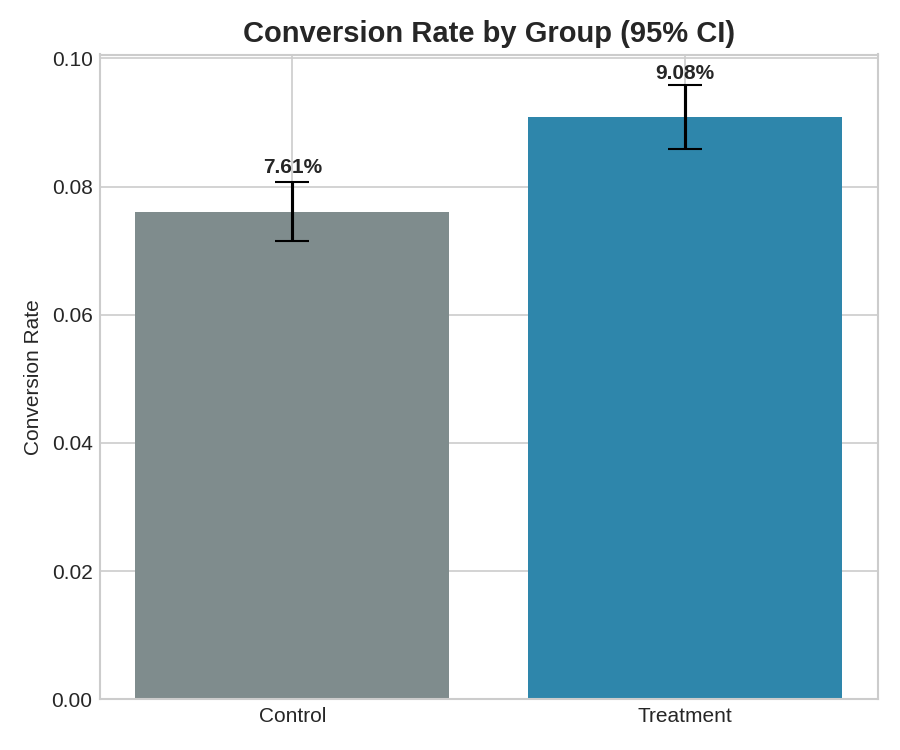
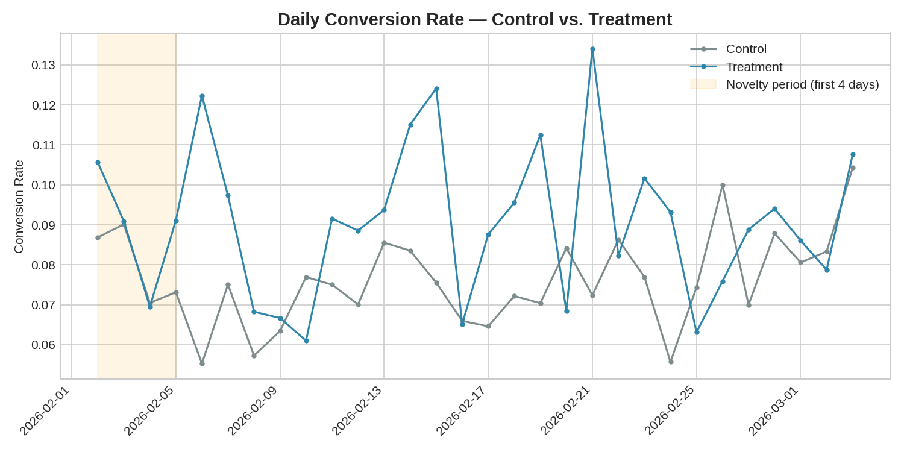
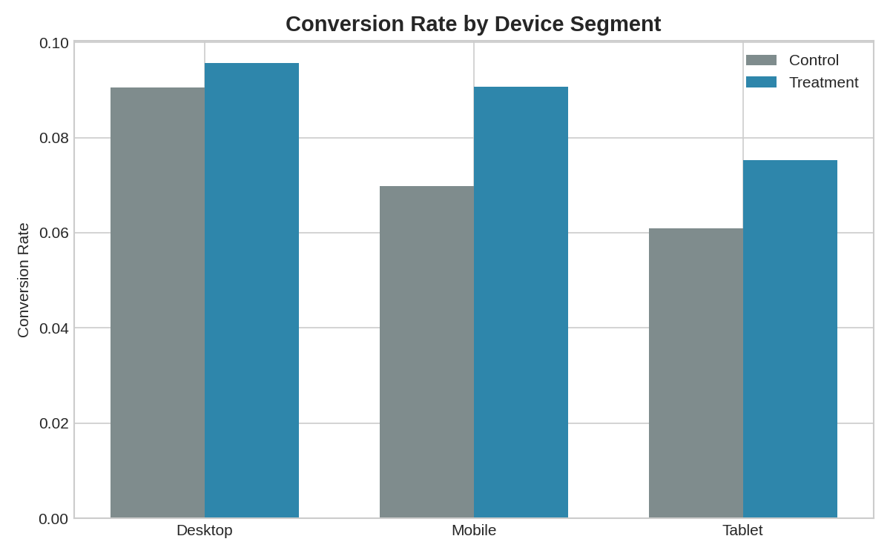
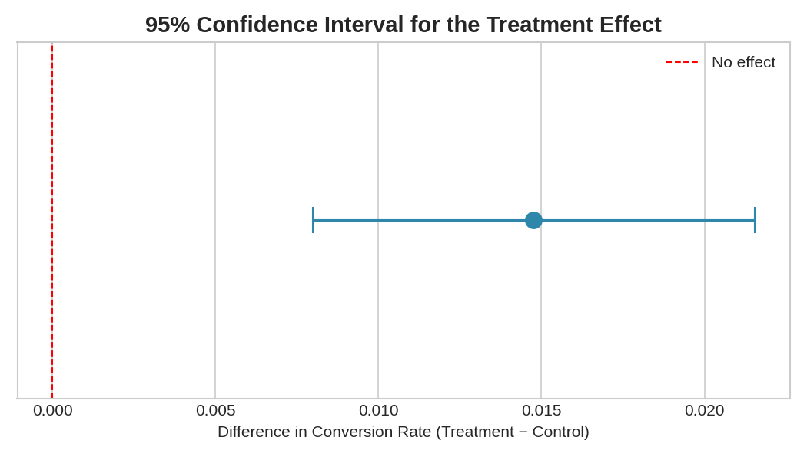

# A/B Test Analysis: Checkout Redesign

Should we ship a redesigned checkout flow? This project runs a full
statistical analysis of a 30-day A/B test — not just "is the difference
significant," but the QA checks a real experimentation team would run before
trusting that answer: sample ratio mismatch, minimum detectable effect,
novelty effects, and whether the result actually holds up across segments
or is being driven by just one of them. Built using **Python (scipy, pandas)**
and **SQL**.

## Problem Statement

A checkout redesign was tested against the existing checkout on live traffic.
The naive question is "did conversion go up?" The real question this project
answers is: *is that lift real, is it big enough to matter, is it consistent
across user segments, and should the team actually ship it?*

## Tech Stack

- **Python**: pandas, numpy, scipy.stats (two-proportion z-test, Welch's
  t-test, chi-square test), matplotlib
- **SQL**: SQLite (queries portable to PostgreSQL/MySQL with minor tweaks)
- **Data**: synthetic user-level experiment data (25,559 users, 30 days) —
  intentionally includes missing values, inconsistent group-label casing,
  and duplicate rows for cleaning practice

## Project Structure

```
ab-testing-checkout-analysis/
├── data/
│   ├── experiment_data.csv          # raw user-level experiment data (with data quality issues)
│   ├── experiment_data_clean.csv    # cleaned data (output of analysis.py)
│   ├── segment_results.csv          # conversion rate + significance by device segment
│   └── summary_metrics.csv          # key headline metrics
├── sql/
│   └── schema_and_queries.sql       # table schema + 10 business-question queries
├── images/                          # generated charts
├── analysis.py                      # cleaning + statistical testing + segment analysis
├── AB_TEST_REPORT.md                # full experiment report + ship/no-ship recommendation
└── README.md
```

## How to Run

```bash
pip install pandas numpy scipy matplotlib
python analysis.py
```

This cleans the data, runs all statistical tests, prints results to the
console, and regenerates all charts in `images/`.

To run the SQL queries, load the cleaned CSV into SQLite:
```bash
sqlite3 data/ab_test.db
.mode csv
.import data/experiment_data_clean.csv experiment_data
.read sql/schema_and_queries.sql
```
(Note: rename the `group` column to `group_name` on import, since `group`
is a reserved word in SQL.)

## Data Cleaning Steps

- Removed exact duplicate rows
- Standardized inconsistent group naming (`control` / ` Control ` / `CONTROL` → `Control`)
- Filled missing `device` values with the most common device (mode)

## Methodology

- **Primary metric**: conversion rate, tested with a two-proportion z-test
- **Secondary metric**: revenue per user (ARPU), tested with Welch's t-test
  (doesn't assume equal variance between groups)
- **Sample Ratio Mismatch (SRM) check**: chi-square goodness-of-fit test
  confirming the 50/50 split actually held — skipping this step is a common
  mistake that can make a broken experiment look like a real result
- **Minimum Detectable Effect (MDE)**: a power-analysis sanity check
  confirming the sample size was large enough to trust a "no significant
  difference" result if one had occurred, not just the significant one
- **Segment analysis**: conversion rate re-tested within each device segment,
  since an aggregate effect can hide the fact that it's really only true for
  one part of the audience (or, in the worst case, mask a true effect that's
  being diluted by a segment where it doesn't apply)

## Key Findings

- **The new checkout significantly increased conversion rate**: 7.61% →
  9.08% (**+19.4% relative lift**, p = 0.00002, 95% CI [+0.80pp, +2.15pp])
- **Randomization passed QA**: no Sample Ratio Mismatch detected (p = 0.52),
  so the result can be trusted
- **The effect is not uniform across devices** — Mobile shows a strong,
  significant lift (+2.07pp, p < 0.0001), while Desktop (+0.51pp, p = 0.42)
  and Tablet (+1.44pp, p = 0.15) show no statistically significant
  difference. **The entire measured effect is coming from mobile users.**
- **Revenue per user rose 22.6%** ($5.45 → $6.68), driven entirely by more
  people completing checkout — not by people spending more per order
- **No novelty effect detected**: the lift held steady across the full
  30-day window rather than fading, which is a good sign for the effect's
  durability

### Conversion Rate by Group


### Daily Conversion Rate Trend


### Conversion Rate by Device Segment


### 95% Confidence Interval for the Treatment Effect


## Recommendation

See [`AB_TEST_REPORT.md`](AB_TEST_REPORT.md) for the full write-up: the
ship/no-ship recommendation, why the segment breakdown matters for what to
test next, and caveats on interpreting the result.

## Possible Next Steps

- Re-run the experiment (or extend it) at a different time of year to rule
  out seasonal effects
- Run a follow-up, Desktop/Tablet-specific checkout experiment, since this
  redesign didn't move the needle there
- Track a longer-term metric (e.g. repeat purchase rate) to confirm the
  conversion lift isn't coming at the cost of a worse post-purchase experience

---
*Note: Dataset is synthetically generated for portfolio/demonstration purposes and does not represent a real business or product.*
